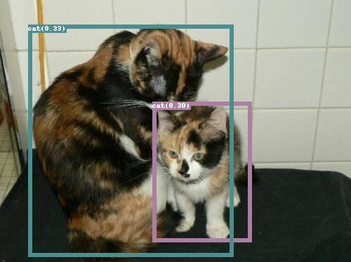
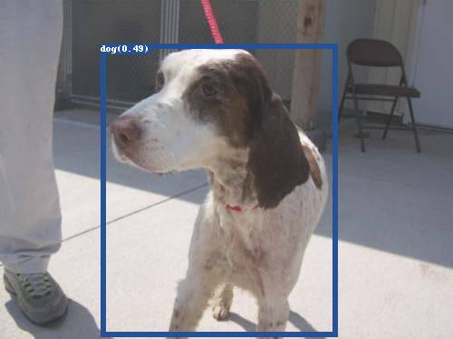

* 2025/1/22：修复验证指标过低问题，由于数据集转换过程中训练集标签从0开始，而验证集标签从1开始，导致验证时标签错位，修改转换脚本同步验证集标签
------------------------------------------------------------------------
官方论文：[Grounding DINO: Marrying DINO with Grounded Pre-Training for Open-Set Object Detection](https://arxiv.org/pdf/2303.05499)

官方项目地址：https://github.com/IDEA-Research/GroundingDINO

微调项目地址：https://github.com/longzw1997/GroundingDino-Finetuning

Swin-T：https://github.com/IDEA-Research/GroundingDINO/releases/download/v0.1.0-alpha/groundingdino_swint_ogc.pth

Swin-B：https://github.com/IDEA-Research/GroundingDINO/releases/download/v0.1.0-alpha2/groundingdino_swinb_cogcoor.pth

---------------------------------------------

记录复现微调GroundingDino的过程，过程遇到的bug以及解决方案

项目中包含所使用的demo数据集和预训练权重，demo数据集采用猫狗检测，coco格式，一共两个类别"cat"和"dog"。

* 数据集结构
```
DATASET
  ├─dogcat_coco            
        ├── annotations
            ├─ instances_train.json
            ├─ instances_val.json
        ├── train
            ├─ 000000000009.jpg
            ├─ 000000580008.jpg
        ├── val
            ├─ 000000000139.jpg
            ├─ 000000000285.jpg
```
### 1.环境配置
* 安装依赖
```
pip install -r requirements.txt
# 注意 numpy < 1.24.* , yapf==0.40.1
```
* 安装groundingdino
```
cd GroundingDino-Finetuning/
pip install -e .
```
* 安装MultiScaleDeformableAttention注意力 
```
cd groundingdino/models/GroundingDINO/ops
python setup.py install
```
* 测试MultiScaleDeformableAttention安装是否成功
```# GroundingDino-Finetuning/groundingdino/models/GroundingDINO/ops
python test.py
```
>True check_forward_equal_with_pytorch_double: max_abs_err 8.67e-19 max_rel_err 2.35e-16<br>
>True check_forward_equal_with_pytorch_float: max_abs_err 4.66e-10 max_rel_err 1.13e-07<br>
>True check_gradient_numerical(D=30)<br>
>True check_gradient_numerical(D=32)<br>
>True check_gradient_numerical(D=64)<br>
>True check_gradient_numerical(D=71)<br>

* 测试环境，下载好预训练权重放到GroundingDino-Finetuning/bert-base-uncased，GroundingDino-Finetuning/MODEL/groundingdino_swinb_cogcoor.pth
```
cd GroundingDino-Finetuning/
python tools/inference_on_a_image.py -i DATASET/test/bus.jpg -c config/cfg_base.py -t 'person . bus' -p MODEL/groundingdino_swinb_cogcoor.pth -o output
```
### 2.数据集准备
* 训练自己的数据集使用odvg格式，先用脚本把coco格式的数据集转换成odvg格式，转换后在同目录下生成instances_train.jsonl文件
```
python tools/coco2odvg.py

# --root 图片根目录，包含train/val
# --train_coco 训练集标签地址
# --val_coco 验证集标签地址
# --mode_train 训练集格式
# --mode_val 验证集格式
# --ori_map 类别映射
# --output 输出数据集配置文件地址
```
### 3.修改配置文件 
* config/cfg_odvg.py，主要更改batch_size、epochs、backbone、label_list

```
data_aug_scales = [480, 512, 544, 576, 608, 640, 672, 704, 736, 768, 800]
data_aug_max_size = 1333          # 图片最大尺寸
data_aug_scales2_resize = [400, 500, 600]
data_aug_scales2_crop = [384, 600]
data_aug_scale_overlap = None
batch_size = 4                               # 设置batch大小
epochs = 15                                   # 迭代次数
lr_drop = 4
save_checkpoint_interval = 1        # 权重保存间隔
modelname = 'groundingdino'
backbone = 'swin_B_384_22k'      # 骨干网路 swin_T_224_1k、 swin_B_384_22k
dn_labelbook_size = 3                   # 标签数量 类别+背景
use_coco_eval = False                  # 使用coco验证
label_list = ["cat","dog"]                  # 类别名
……
```

### 4.修改 finetuning.sh 配置
```
export CUDA_VISIBLE_DEVICES=0
python main.py \
    --config_file config/cfg_odvg.py \
    --datasets config/data_dog_cat.json \
    --output_dir fine_tuning_output/output_dog_cat \
    --pretrain_model_path MODEL/groundingdino_swinb_cogcoor.pth \
    --options text_encoder_type="bert-base-uncased"
```
### 5.开始训练
```
bash finetuning.sh
```
### 6.测试模型预测效果
```
python tools/inference.py -i DATASET/catdog_coco/val/ -c config/cfg_odvg.py -t 'cat . dog' -p fine_tuning_output/output_dog_cat/checkpoint_best_regular.pth -o output
```
<center class="half">
    
</center >

#### 报错记录
>ImportError: libGL.so.1: cannot open shared object file: No such file or directory
```
apt-get update
apt-get install -y libgl1
```

